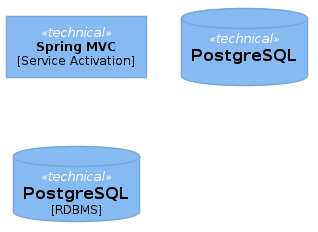
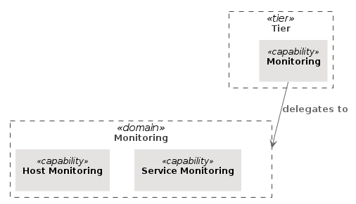
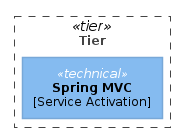
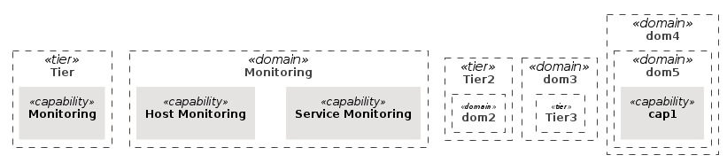
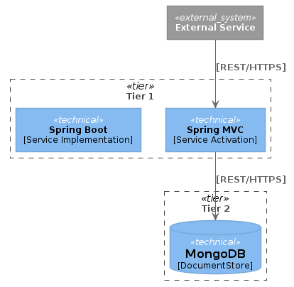
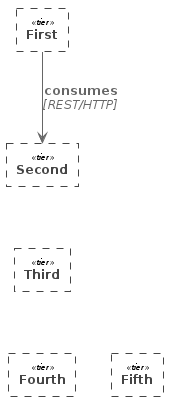

= C4-arch-template

C4 compatible macros extensions.

== Usage
If you use it in your projects, your plantuml file should contain the following include statemen:

`!include https://raw.githubusercontent.com/rattermeyer/C4-ArchTemplate/release/1-0/C4_arch_template.puml`

[source]
----
@startuml
!include https://raw.githubusercontent.com/rattermeyer/C4-ArchTemplate/release/1-0/C4_arch_template.puml

Tech_Component(springMvc, "Spring MVC", "Service Activation")
Tech_Component_Db(postgres, "PostgreSQL")
Tech_Component_Db(postgres2, "PostgreSQL", "RDBMS")

@enduml
----

=== Directives

The extension provdides the following functions

|===
|Function | Usage
|tier(alias, "name") | Creates a new boundary with stereotype `<< tier >>`
|tier(alias, "name", "description") | Creates a new boundary with stereotype `<< tier >>`
|Tech_Component(alias, "technology", "technical_capability") | Shows a technical component and adressed technical capabilities
|Tech_Component(alias, "technology") | Shows a technical component 
|Capability(alias, "technical_capability") | shows the technical capability (as part of a tier)
|Domain(alias, "name") | Create a new boundary with stereotype `<<domain>>`
|===

The same Layout and Relationship helpers as with the 

== Examples

[source]
----
@startuml
!include https://raw.githubusercontent.com/rattermeyer/C4-ArchTemplate/release/1-0/C4_arch_template.puml

Tech_Component(springMvc, "Spring MVC", "Service Activation")
Tech_Component_Db(postgres, "PostgreSQL")
Tech_Component_Db(postgres2, "PostgreSQL", "RDBMS")
@enduml
----

Will produce

[source]
----
@startuml
!include https://raw.githubusercontent.com/rattermeyer/C4-ArchTemplate/release/1-0/C4_arch_template.puml

Tier(tier, "Tier") {
    Capability(monitoring, "Monitoring")
}

Domain(dom1, "Monitoring") {
    Capability(serviceMonitoring, "Service Monitoring")
    Capability(hostMonitoring, "Host Monitoring")
}

Lay_D(tier,dom1)
Rel_D(monitoring,dom1, "delegates to")

@enduml

----

Will produce

[source]
----
@startuml
!includeurl https://raw.githubusercontent.com/rattermeyer/C4-ArchTemplate/release/1-0/C4_arch_template.puml

Tier(tier, "Tier") {
    Tech_Component(springMvc, "Spring MVC", "Service Activation")
}
@enduml
----

Will produce

.Tier and Domain Nested
[source]
----
@startuml
!includeurl https://raw.githubusercontent.com/rattermeyer/C4-ArchTemplate/release/1-0/C4_arch_template.puml

' LAYOUT_AS_SKETCH()
' LAYOUT_TOP_DOWN

Tier(tier, "Tier") {
    Capability(monitoring, "Monitoring")
}

Domain(dom1, "Monitoring") {
    Capability(serviceMonitoring, "Service Monitoring")
    Capability(hostMonitoring, "Host Monitoring")
}

Tier(tier2, "Tier2") {
    Domain(dom2, "dom2"){
    }
}

Domain(dom3, "dom3"){
   Tier(tier3, "Tier3") {
   }
}

Domain(dom4, "dom4"){
   Domain(dom5, "dom5"){
      Capability(cap1, "cap1")
   }
}

@enduml
----

Will produce

.Techcomponent and Relations
[source]
----
@startuml
!includeurl ../C4_arch_template.puml
!includeurl https://raw.githubusercontent.com/RicardoNiepel/C4-PlantUML/release/1-0/C4_Container.puml
Tier(tier1, "Tier 1") {
    Tech_Component(springMvc, "Spring MVC", "Service Activation")
    Tech_Component(springBoot, "Spring Boot", "Service Implementation")
}
Tier(tier2, "Tier 2") {
    Tech_Component_Db(mongoDB, "MongoDB", "DocumentStore")
}
System_Ext(ext, "External Service")

Rel(ext,springMvc, "[REST/HTTPS]")
Rel(springMvc, mongoDB, "[REST/HTTPS]")

@enduml
----

Will produce

.Tiers
[source]
----
@startuml
!includeurl https://raw.githubusercontent.com/RicardoNiepel/C4-PlantUML/release/1-0/C4_Container.puml

' LAYOUT_AS_SKETCH()

Tier(first, "First") {
}

Tier(second, "Second") {
}

Tier(third, "Third") {
}

Tier(fourth, "Fourth") {
}
Tier(fifth, "Fifth") {
}

Rel_Down(first,second,"consumes", "REST/HTTP")
second-[hidden]-third
third-[hidden]-fourth
fourth-[hidden]fifth

@enduml
----

Will produce

